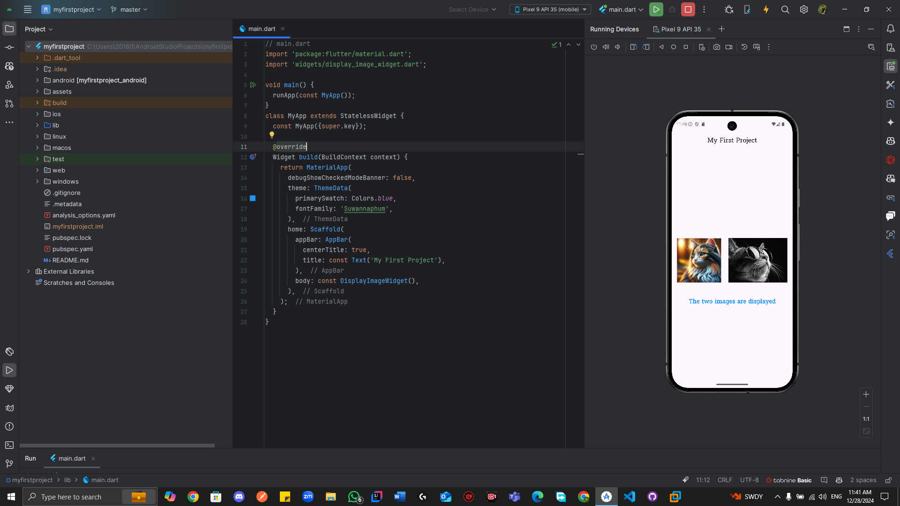

# Flutter Image Display Project

A simple Flutter project that demonstrates the use of StatelessWidget to display images and text.

## Features

- Displays a title in the AppBar
- Shows two images side by side:
    - One loaded from local assets
    - One loaded from the internet
- Displays custom styled text below the images
- Uses the Suwannaphum font family

## Code Structure

- `lib/main.dart`: Contains the main application setup
- `lib/widgets/display_image_widget.dart`: Contains the custom widget for displaying images and text
- `assets/`: Contains local images and fonts

## How to Run

1. Ensure Flutter is installed on your system
2. Clone this repository
3. Run `flutter pub get` to install dependencies
4. Run `flutter run` to start the application

## Code Explanation

The project uses a StatelessWidget to create a simple UI that displays images and text. The layout is centered and uses Column and Row widgets for arrangement. Custom styling is applied to the text using TextStyle.

## Output

